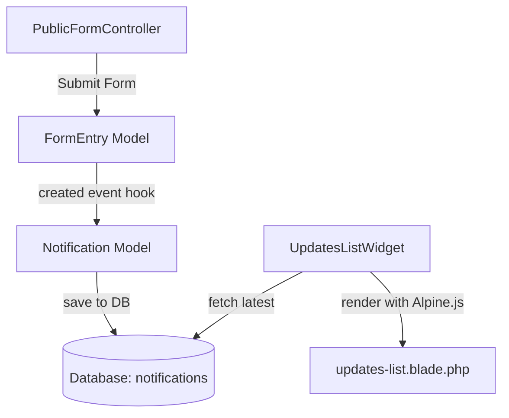

# Spec: Dynamic Dashboard Notifications

Make the dashboard notification block (Updates List Widget) dynamic by storing notifications in the database and automatically creating notifications when forms are submitted.

## 1. System Overview

Currently, the notification block (`UpdatesListWidget`) renders static, hardcoded data. We will transition to a database-backed model where:
- Form submissions automatically generate new notifications.
- The dashboard updates list fetches notifications from the database.
- Alpine.js provides client-side searching and tab filtering (Today, Yesterday, This week).

## 2. Technical Design

### 2.1 Database Schema
We will create a migration `create_notifications_table`:
- `id` (bigIncrements)
- `title` (string)
- `sub` (string)
- `icon` (string, default: `'fa-solid fa-comments'`)
- `tone` (string, default: `'text-text-muted'`)
- `created_at` / `updated_at` (timestamps)

### 2.2 Notification Model
Create `App\Models\Notification` model with:
- `$fillable = ['title', 'sub', 'icon', 'tone']`
- Accessor `getPeriodAttribute()` returns `'Today'`, `'Yesterday'`, or `'This week'` based on `created_at`.
- Accessor `getFormattedTimeAttribute()` returns:
  - `'g:i A'` if created today.
  - `'Yesterday g:i A'` if yesterday.
  - `'M d'` if earlier this week.

### 2.3 Form Submission Hook
In `App\Models\FormEntry`, listen to the `created` event inside the `booted` method:
- Read the submitted data and extract the first 1-2 non-empty values (e.g., `full_name`, `email`) for the subtitle.
- Create a `Notification` record:
  - `title`: `'New Entry: ' . $form->title`
  - `sub`: The extracted summary.
  - `icon`: The form's icon (fallback to `'fa-solid fa-comments'`).
  - `tone`: `'text-text-muted'`.

### 2.4 Interactive UI and Alpine.js
- In `updates-list.blade.php`, bind the search input with `x-model="searchQuery"`.
- Use Alpine's `x-show` to hide/show list items based on the active tab/period and search query.
- Maintain dynamic notification counts and pending review counts.
- Add a "No notifications found" template state.

## 3. Testing and Verification
- Create feature tests to verify:
  - Form submission generates a new Notification model in the database.
  - The notification widget displays the newly created notification.
  - The search and period filtering functions properly render in the Blade view.
